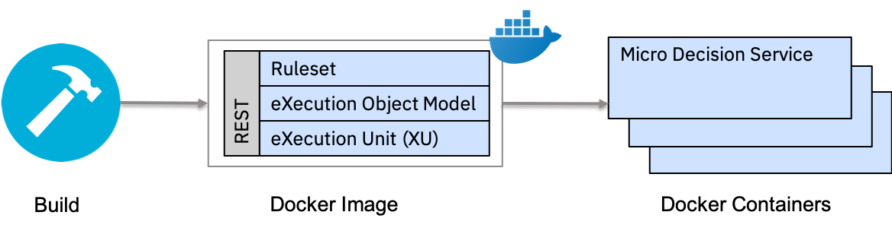

# Micro Decision Service

The goal of this project is to show how to automate the building of a micro decision service to execute a ruleset. The proposed pipeline generates a lightweight Docker container that empowers the execution of a given ruleset through a REST JSON endpoint.
<br><br>
This approach offers a complete isolation across multiple micro decision services running as separated Docker containers that scale independently.
In term of performance, the lightweight stack reduces the boot time for the first execution, and well fits with the horizontal scalability provided by a http(s) load balancing. 





The client generates a Docker image from:
* one eXecutable Object Model (XOM) and one ruleset or,
* one XOM and one RuleApp or,
* one XOM and one rule project

## Prerequisites

Install Java 8 and Maven.  
Install Operational Decision Manager.  
If you are using Docker, install it and start it.  
Set up the following environment variables to run the generator:

* ODMLIB : ODM_INSTALLATION_FOLDER/executionserver/lib  

* ODMBUILD : ODM_INSTALLATION_FOLDER/buildcommand/rules-compiler  

The generator can be run on local or by using Docker. Scripts are provided for both cases. 

## Step 1: Building the generator

Start the build with :

```bash
./build.sh
```

or 

```bash
./buildDocker.sh
```

The build requires ODMLIB and ODMBUILD environment variables set as explained in the
 presequisites section.
 
To build the Docker image, use the buildDocker.sh script rather than directly using the docker build command.
 A Dockerfile build is limited to its current context. It means that the content of
  ODMLIB and ODMBUILD must be in the build context. The docker build script copies the content
   of the required folder in the context before the build, and remove them at the end.
   
The build.sh script generates the JAR archive: decisionMicroservice/decisionMicroserviceClient/target/decisionMicroserviceClient.jar. 
This archive will be used for the service generated by the generate.sh script.

Warning information about the overlapping classes might be logged during the build. These warnings are caused by the common dependencies between the Operational Decision Manager libraries. You can ignore the warnings since the build still works fine.

## Step 2: Generating the Docker image

All the generation scripts use the same parameters. For more information about the parameters, 
see the parameters used in the generation scripts topic below.

### End-to-end generation

The generate-image.sh script provides the easiest way to realize the end-to-end generation. 
The only requirement is to run Docker. Once executed, the built image 
can be run with the docker run command, which is displayed at the end of the build.

```bash
./generate-image.sh -i samples/options/LoanScoreOpt.json -p dockerName=decisionimage -p serverPort=9090
```

In this example, the name of the generated Docker image and the port are also specified.

Use the following command to run the Docker image:


```bash
docker run -p 9090:9090 decisionImage
```

Using this method, all the generated intermediate files are deleted at the end of the
 execution of the script. The command fails if you specify the output folder, so keep the default folder. 
If you want to keep the generated intermediate files, use the step-by-step method.

### Step-by-step generation

#### Code generation

You can use the generate.sh and generate-in-docker.sh scripts to generate only the code and not 
to generate the Docker image. The both scripts have the same signature and the same behavior. 
The output will be placed in the folder specified with the -o flag or in the folder specified 
in the configuration file. The following example uses JSON:

```bash
./generate.sh -i samples/options/MiniloanOpt.json
```
or 
```bash
./generate-in-docker.sh -i samples/options/MiniloanOpt.json
```

If you are running the generation scripts outside Docker, you must set the two environment 
variables (ODMLIB and ODMBUILD). It is not necessary when you are using the Docker image.

When you use the above configuration files, the generated code can be found in the default folder

#### image build

The image is built by using the buildDocker.sh script in the generated folder. 
At the end of execution of the build script, the command 
to launch the container is displayed. Use the startDocker.sh script to run the container:

```bash
./buildDocker.sh
```

### Parameters used in the generation scripts

The generation scripts can take different parameters. 
They are provided. You can specify the parameters in a JSON file or directly from 
the command line. 
All the command line arguments take precedence over the JSON file arguments.

Note that all the paths in the option file will not be evaluated from the file location,
 but from the executed location.

You can find example options files in samples/options. The following list shows all the available
 parameters with their names in the JSON configuration file.

* -i, --input 

Specify the path to the JSON configuration file

* -x, --xom, xomPath

This argument is mandatory. Specify the XOM used by the ruleset.

* -s, --ruleset, ruleSetPath

Specify the path to the ruleset.

*  -rp, --ruleproject, ruleProject

Specify the path to the rule project folder. You must define 
a folder where the .ruleproject file is. 
It will be used to generete the RuleApp.

* -dep, --deploymentname, deploymentName

Specify the deployment name when generating the RuleApp from the rule project. 
This parameter goes in pair with the ruleProject parameter. 
Both must be specified to generate the RuleApp from the rule project

* -r, --ruleapp, ruleAppPath

Specify the path to the RuleApp file. If it is specified, the rule project build will be skipped.

* -sa, --rulesetarchive, rulesetArchivePath

Specify the path to the ruleset archive. This file must be in JAR or DSAR format.
If it is not specified, it will be retrieved from the RuleApp and the ruleset path.

* -a, --openapi, openApiPath

Specify the path to the openApi specification. 
If it is not present, it will be generated from the ruleset.

* -o, --outputdir, outputDirectory

Specify the folder where the project will be generated. 
This opetion is not available when the generate-image.sh script is used.

* -f, --framework

Specify the framework used for the generated service.
 Select either micronaut or spring. The default is spring.

#### Additional Properties

-p, --properties, additionalProperties

You can specify additional properties. 
On the CLI using the -p <key>=<value> format or in the additionalProperties json
 Object of the json file. The following properties are available

* serverPort

The port that the internal server listens to

* dockerName

The name of the generated image

* servicePath

The path of the request the server answers to. If an openApi specification file is specified, 
the specication values take precedence.

* buildImage

The generated Dockerfile is multi-stage. 
The first stage is to generate the JAR file by using maven. 
By default, the image used is maven:3.6-jdk-8. 
It requires to download all project dependencies at build time, making the build longer.

To avoid this specify a build image that already has the necessary dependencies pre loaded for 
a faster build. The specified image must be reachable at build time.


* dateFormat

The date format used to serialize/deserialize date.
 The format must follow the Java DateTimeFormatter that is described 
[here](https://docs.oracle.com/javase/8/docs/api/java/time/format/DateTimeFormatter.html#patterns)

The default value is "yyyy-MM-dd'T'HH:mm:ss.SSSX". For instance: "2019-04-05T13:31:46.858Z"

* poolSize

The maximum number of XU connections available. It is the maximum number of 
connections that the service can handle concurrently. Default value is 100.

### Input Configurations

All the parameters listed above are not mandatory for the generation to work.

As we mentioned at the beginning of this documentation, 
different configurations are available to generate a micro-decision service. 
The configuration used for the generation depends on the arguments given to the generator.

Three configurations are available:


#### 1. one XOM and one ruleset 

Use the ruleset archive (.jar or .dsar) to generate the RuleApp that is 
required for the ruleset execution

Required arguments:
* --xom
* --rulesetarchive

#### 2. one XOM and one ruleapp 

A RuleApp is used for the ruleset execution. 
The ruleset is extracted from the RuleApp by using the ruleset path.

Required arguments:

* --xom
* --ruleset
* --ruleapp


#### 3. one XOM and one rule project

Compile the rule project into a RuleApp by using the deployment name. 
The ruleset is extracted from the generated ruleapp.

Required arguments:
* --xom
* --ruleproject
* --rulesetpath
* --deploymentname


If multiple configurations are eligible, 
the following order is used to choose the configuration: 
Ruleset configuration > RuleApp configuration > Rule project configuration

### Generated project

The generated project contains a Maven project and a Dockerfile as well as utility scripts.

It is built by using the buildDocker.sh command and running the container with the startDocker.sh 
script. The container can be run manually by using the docker run command to add additional 
arguments.

The generated service is using Spring Boot. It takes a JSON payload as input, and outputs a 
JSON payload. The interface is described more precisely in the OpenAPI specification  in 
<generated_folder>/lib.
 

### Docker File sharing on OS X
When using Docker to build and run the generation, a volume will be created in a 
location designated by the ODMLIB and ODMBUILD variables. 
You might need to manually add the path to Docker. 
If you need to do so, use the Docker preference interface, 
go to the File Sharing tab, and then add the required path.
